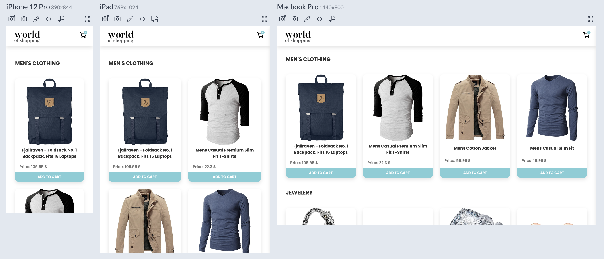
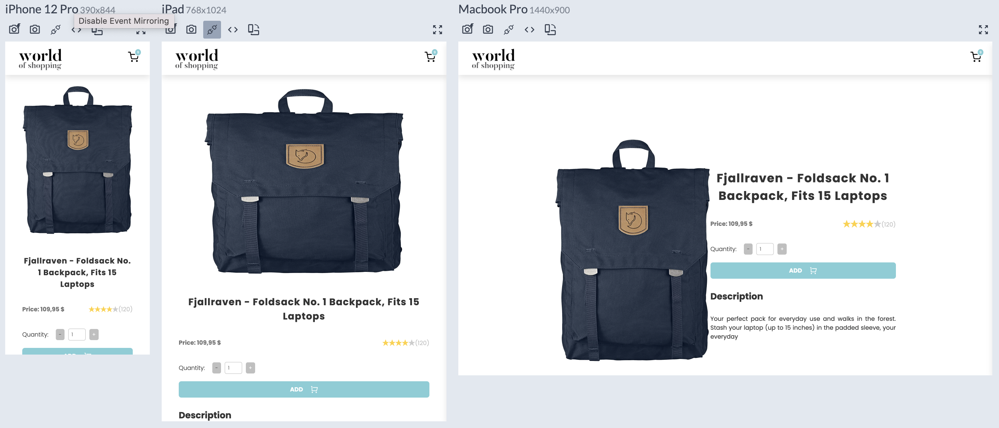
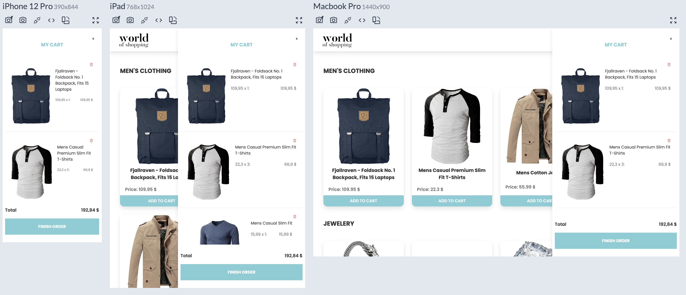
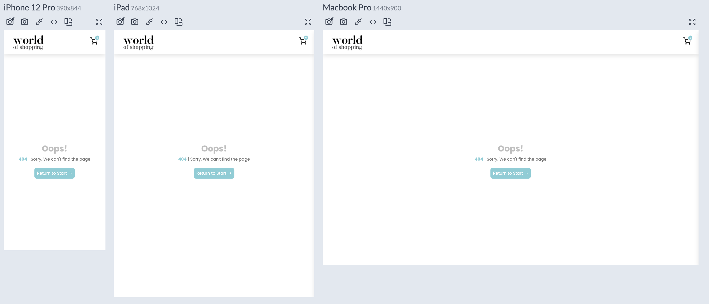

# WORLD OF SHOPPING

  Esta aplicación ha sido desarrollada utilizando React y JavaScript. Hace uso de la API pública de Fake Store API para obtener información de los productos. En la página de inicio, encontrarás un listado de productos agrupados por categoría.
 
<br>

### Clonar Repositorio
<hr>

```bash
  $ git clone https://github.com/andreajhl/world-of-shopping
```
<br>
<br>

### Cómo Probar
<hr>

* Después de clonar el repositorio, accede a la carpeta del proyecto desde tu editor de código favorito.
* En la terminal del proyecto, ejecuta el siguiente comando para instalar las dependencias: ```npm install```.
* Una vez finalizada la instalación, inicia el proyecto con el siguiente comando: ```npm run start```.
* Si deseas ejecutar las pruebas, utiliza: ```npm run test```
<br>
<br>

### Tecnologías Utilizadas
<hr>

* #### React
* #### Javascript
* #### Sass
* #### Jest
<br>
<br>

### Pantallas del Proyecto y Usos
<hr>

* ### Página de Inicio

<br>

  La página de inicio cuenta con un listado de productos agrupados por categoria, desde aquí, puedes acceder a los detalles haciendo clic sobre el título o agregar al carrito de compras.

<br>



<br>
<br>


* ### Detalles del Producto
<br>

  En esta pantalla, podrás encontrar la descripción, valoraciones y precio. También podrás agregar al carrito (máximo 6 unidades).

<br>


<br>
<br>

* ### Carrito de Compras
<br>

  El carrito de compras está disponible en toda la aplicación. Basta con tocar el icono del carrito para expandirlo. Aquí podrás ver el precio total de la compra, y un resumen de todos los artículos agregados.

<br>


<br>
<br>

* ### Página 404
<br>

  Si ocurre algún error al cargar algún módulo o intentas acceder a una página que no existe, serás redirigido aquí. No te preocupes, puedes volver a la página de inicio desde el logotipo ubicado en la esquina superior izquierda o desde el botón.

<br>


<br>
<br>
